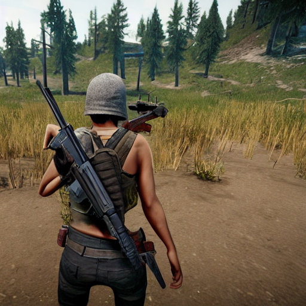

## Demo


## How it works
- Enter a text prompt
- Stable Diffusion generates an image
- Image is displayed in Streamlit UI

## Run Locally
```bash
pip install -r requirements.txt
streamlit run app.py
